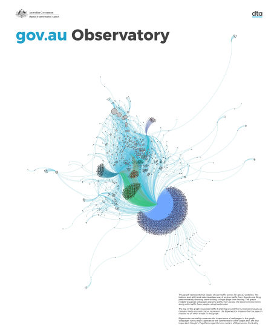

# gov.au Observatory

To quantify interactions with government services, creating insights that support and empower product teams to deliver positive user outcomes

[Functional Behaviour diagram (857KB, PDF)](gov-au_observatory-functional_behaviour.pdf) | [Structural Behaviour diagram (2.8MB, PDF)](gov-au_observatory-structural_behaviour.pdf)
------------ | -------------
 | 

# Contents
* [About gov.au Observatory](#about-gov.au-observatory)
  * [Privacy](#privacy)
  * [Subscribing](#subscribing)
* [About this repository](#about-this-repository)
  * [Selected Examples](#selected-examples)
* [Running the alpha prototype](#running-the-alpha-prototype)

----------------------------------------------------------------------------------------------------------------------------------------------------------------

# About gov.au Observatory
The gov.au Observatory aims to quantify interactions with government services and support delivery teams to improve their own products and services. 
Using anonymous analytics data, we are creating prototypes that visualise user intent, language, behaviour and service outcomes. We want to show where individual services fit in to the broader environment.
We want government to deliver the best services it possibly can, and part of that is [measuring performance](https://www.dta.gov.au/help-and-advice/digital-service-standard/digital-service-standard-criteria/11-measure-performance). The Observatory will help to give context and quantifiable measures to delivery teams striving to improve.

## Privacy
The Observatory does not:
- use any personally identifiable information (PII),
- sell data,
- provide data access to third parties unless strictly required under our [Terms of Service](https://www.dta.gov.au/our-projects/google-analytics-government/dta-terms-service-google-analytics-360).

## Subscribing
If you're working in government and would like to join or learn more, please visit the [Observatory](https://www.dta.gov.au/our-projects/govau-observatory) on [dta.gov.au](https://www.dta.gov.au/).

## About this repository
This repository contains our work in progress:
The folders are structured like so:

* /dags - Airflow data pipelines. See [Airflow 101](AIRFLOW101.md) for more information.
  * /docker - A docker image we use in data pipelines with R packages
* /notebooks - Juptyer notebooks of experiments in data analysis
* /scripts - SQL/R scripts we have used to extract data from Bigquery and other sources
* /html - A HTML based alpha prototype of a future web interface to the data
* /shiny - Interactive data exploration prototypes in R/Shiny

### Selected examples:
* [/shiny/observatory](/shiny/observatory) - A R/Shiny app running on CloudFoundry that has a Design System theme and uses chart, network and custom D3 visualisations
  * [/dags/observatory.py](/dags/observatory.py) - Demonstrates automatically deploying an app from Airflow to cloud.gov.au CloudFoundry
* [/scripts/structural_neo4j.cypher](/scripts/structural_neo4j.cypher) - An example of importing CSV data into Neo4j and running basic queries
* [/scripts/visa_extract_parser.py](/scripts/visa_extract_parser.py) - An example of converting Google Analytics hit data in BigQuery into a network graph with URL sanitization
* [/notebooks/searchqueries.ipynb](/notebooks/searchqueries.ipynb) and [notebooks/searchqueries-forurl.ipynb](notebooks/searchqueries-forurl.ipynb) - Notebooks demonstrating using natural language processing to group similar search queries from Google Search Console
* [/notebooks/Webcrawl%20network.ipynb](/notebooks/Webcrawl%20network.ipynb) - Converting a CSV of from/to links into a network graph in Python/NetworkX
* [/dags/r_scripts/extractaccinfo.R](/dags/r_scripts/extractaccinfo.R) - Using Google Analytics API in R
  * [/dags/ga_quarterly_reporter.py](/dags/ga_quarterly_reporter.py) - Demonstrates calling an R script on a schedule via Airflow and storing the result in Google Cloud Storage
* [/dags/galileo/ga.py](/dags/galileo/ga.py) - Using Google Analytics API in Python
* [/dags/galileo/searchconsole.py](/dags/galileo/searchconsole.py) - Using Google Search Console API in Python
  * [/dags/web_search_reporter.py](/dags/web_search_reporter.py) - Demonstrates calling search console API as well as BigQuery for Internal Site Search on a schedule through Airflow

## Running the alpha prototype
### Using Observatory data (internal staff only)
To run the HTML version, download augov.gexf from /data on Google Cloud Storage, put it in html/observatory/data and run html/observatory/run.sh

### Using your own data 
We currently use a customised version of Gephi's .gexf file format, adding a "domain" column. 
You may be able to use a tool like [HttpGraph](https://gephi.org/plugins/#/plugin/httpgraph) as a starting point to create your own.

# Some reading 
## Blog articles we have written
We are putting out blog content, our first blog can be found here:
- [gov.au Observatory: Digital Constellations from user journeys](https://www.dta.gov.au/blogs/govau-observatory-digital-constellations-user-journeys)

## Blog articles we recommend
- https://dataingovernment.blog.gov.uk/2019/05/29/connecting-the-dots-network-science-on-gov-uk/
- https://snowplowanalytics.com/blog/2018/03/26/building-a-model-for-atomic-event-data-as-a-graph/
- https://datarunsdeep.com.au/blog/flying-beagle/how-consistently-select-randomly-distributed-sample-rows-bigquery-table

